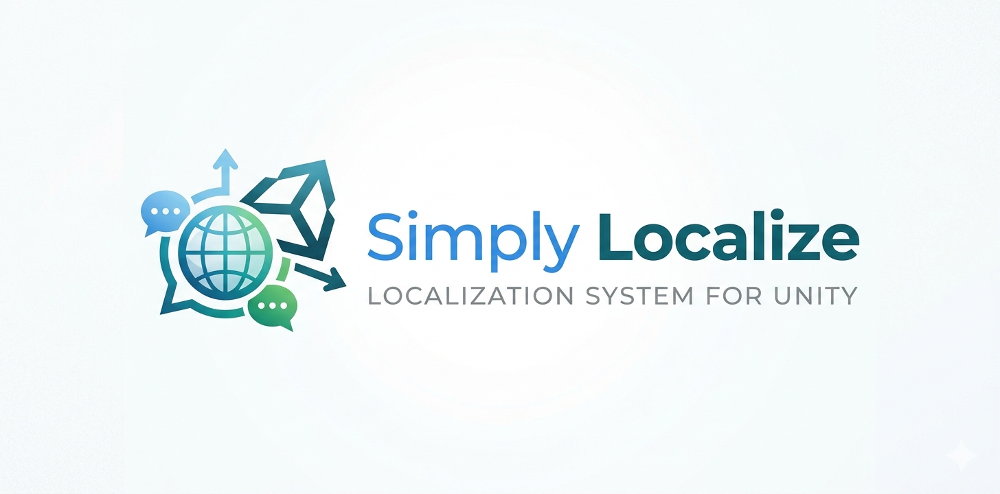
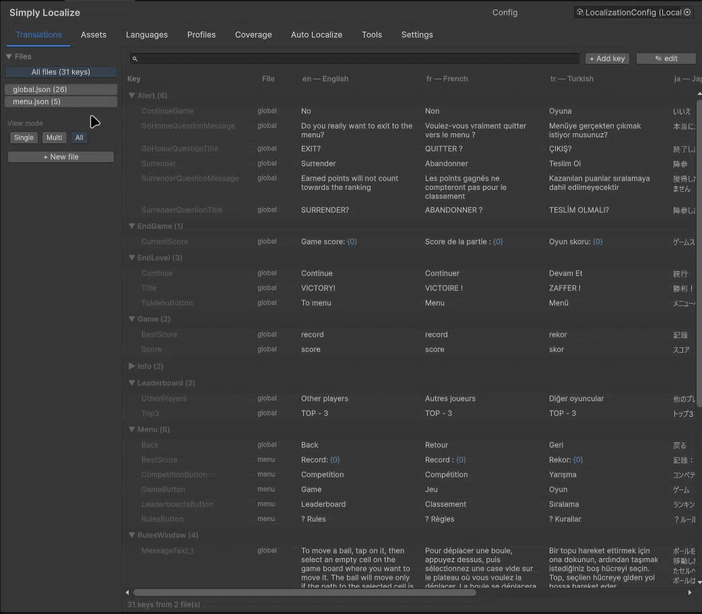
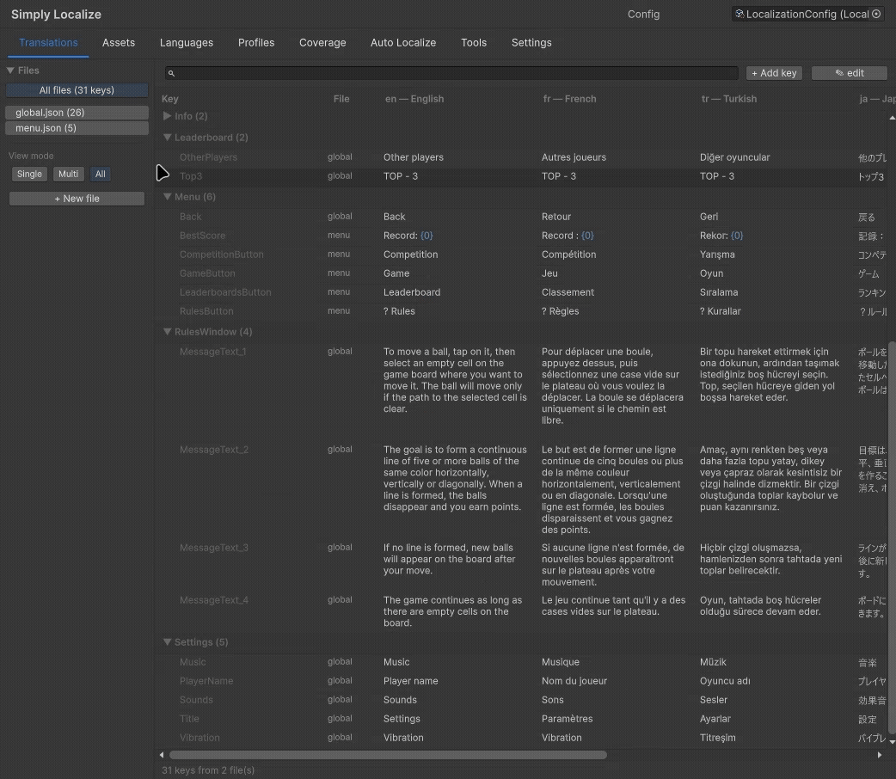
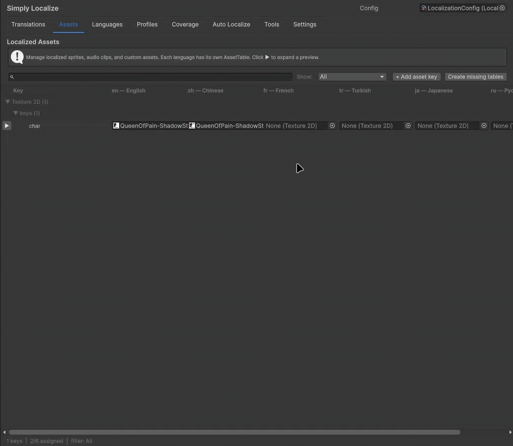
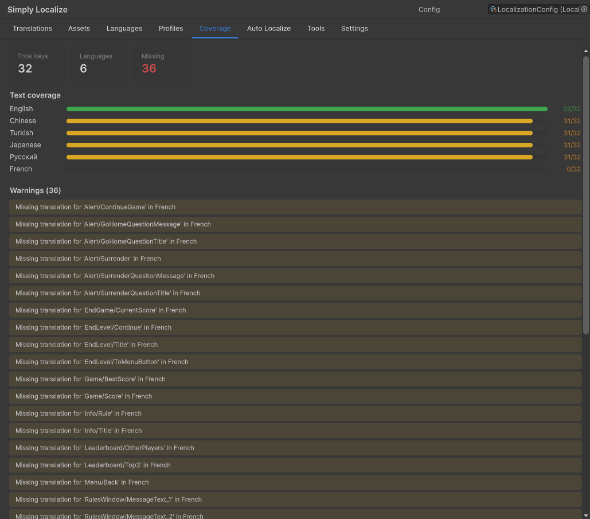

# Simply Localize



A modern, flexible localization system for Unity. Manages translations, localized assets (sprites, audio, any `UnityEngine.Object`), fonts per language, pluralization across languages, runtime language switching, and a rich editor workflow — all without external dependencies.

*Read in other languages: [Russian](README_RU.md).*

---

## Table of Contents

- [Features](#features)
- [Installation](#installation)
  - [Via OpenUPM](#via-openupm)
  - [Via Package Manager (Git URL)](#via-package-manager-git-url)
  - [Via manifest.json](#via-manifestjson)
- [Quick Start](#quick-start)
- [Folder Structure](#folder-structure)
- [Editor Window](#editor-window)
- [Runtime API](#runtime-api)
- [Components](#components)
- [Pluralization & Parameters](#pluralization--parameters)
- [Language Profiles & Fonts](#language-profiles--fonts)
- [Fallback Chains](#fallback-chains)
- [Localized Assets](#localized-assets)
- [Dependency Injection](#dependency-injection)
- [Extensibility](#extensibility)
- [Attribute Reference](#attribute-reference)
- [Migration from v1](#migration-from-v1)

---

## Features

- **Text localization** — JSON-based, one folder per language, multiple files per language merged automatically
- **Asset localization** — localize sprites, audio clips, materials, prefabs, or any `UnityEngine.Object` type through asset tables; `Localization.GetAsset<T>(key)` is the single runtime API for all types
- **Pluralization** — built-in rules for Germanic, Slavic, Romance, East Asian, and Arabic language families, via simple inline syntax (`{0|apple|apples}`)
- **Parameter substitution** — indexed (`{0}`), named (`{playerName}`), or mixed; both `string.Format`-compatible and self-describing
- **Language profiles** — per-language font (TMP + legacy), font size multiplier, weight, spacing, text direction (LTR/RTL), alignment overrides
- **Per-language fallback chains** — e.g. `Ukrainian → Russian → English`; each profile points to its own fallback, resolved lazily with cycle protection
- **Per-component profile overrides** — individual UI elements can override specific sections (font only, spacing only, etc.) of the language profile
- **Runtime language switching** — single call updates all active components via events
- **Rich editor window** — virtualized translations table, search, drag-and-drop asset tables, inline previews, undo/redo, key renaming with automatic reference updates in scenes & prefabs, coverage analysis, CSV export
- **Extensible** — custom asset preview renderers and type filters via plain interfaces + `TypeCache` discovery; custom tabs via `[LocalizationEditorTab]` attribute
- **DI-friendly** — use the static `Localization` facade for simplicity, or inject `LocalizationManager` directly for testability
- **WebGL support** — console log bridge included
- **No external dependencies** — pure C#, no third-party packages required

---

## Installation

### Via OpenUPM

**Option A — OpenUPM CLI** (recommended):

```bash
npm install -g openupm-cli
openupm add com.renkoff.simply-localize
```

**Option B — manually via `Packages/manifest.json`**:

1. Add a scoped registry entry:

```json
{
  "scopedRegistries": [
    {
      "name": "OpenUPM",
      "url": "https://package.openupm.com",
      "scopes": [
        "com.renkoff"
      ]
    }
  ],
  "dependencies": {
    "com.renkoff.simply-localize": "2.0.0-alpha.2"
  }
}
```

### Via Package Manager (Git URL)

1. Open `Window → Package Manager`
2. Click `+ → Add package from git URL`
3. Paste:

```
https://github.com/RenKOFFF/Simply-Localize-Localization-System-for-Unity.git?path=src/SimplyLocalize
```

### Via manifest.json

Add to your `Packages/manifest.json`:

```json
{
  "dependencies": {
    "com.renkoff.simply-localize": "https://github.com/RenKOFFF/Simply-Localize-Localization-System-for-Unity.git?path=src/SimplyLocalize"
  }
}
```

---

## Quick Start

### 1. Create a Localization Config

`Create → SimplyLocalize → Localization Config`

Place it in any `Resources` folder so it can be auto-loaded at runtime.

### 2. Create Language Profiles

`Create → SimplyLocalize → Language Profile` for each language (English, Russian, Japanese, etc.)

Fill in the `languageCode`, `displayName`, `systemLanguage` fields and add the profile to your `LocalizationConfig.languages` list.

> **Tip:** You can also create languages directly from the editor window via the **Languages** tab — it auto-generates the folder structure and JSON files for you.

### 3. Open the Editor Window

`Window → SimplyLocalize → Localization Editor`

The window has 8 tabs: **Translations**, **Assets**, **Languages**, **Profiles**, **Coverage**, **Auto Localize**, **Tools**, **Settings**.


<!-- TODO: replace with actual screenshot -->

### 4. Add Your First Keys

In the **Translations** tab:
- Click **`+ Add key`** in the toolbar
- Enter a key (e.g. `UI/MainMenu/Play`) and choose a source file
- Fill in translations for each language inline

### 5. Initialize at Runtime

```csharp
using SimplyLocalize;
using UnityEngine;

public class GameBootstrap : MonoBehaviour
{
    [SerializeField] private LocalizationConfig _config;

    private void Awake()
    {
        // Initialize with explicit config
        Localization.Initialize(_config);

        // Or auto-detect the player's system language
        Localization.SetLanguageAuto();
    }
}
```

Alternatively, enable **Auto Initialize** on your `LocalizationConfig` asset — the system will load itself from `Resources` before any scene is loaded.

### 6. Use It

```csharp
string greeting = Localization.Get("UI/Welcome");
string score = Localization.Get("UI/Score", 100);
Sprite flag = Localization.GetAsset<Sprite>("flags/current");
```

Or drop a `LocalizedText` component onto any TextMeshPro / legacy Text element and pick a key in the Inspector — no code needed.

---

## Folder Structure

Your localization data lives inside any `Resources` folder:

```
Assets/
└── Resources/
    └── Localization/        ← base path (configurable in LocalizationConfig)
        ├── _meta.json       ← key metadata (descriptions, rename history)
        ├── en/
        │   ├── text/
        │   │   ├── global.json
        │   │   ├── ui.json
        │   │   └── items.json
        │   └── AssetTable.asset    ← localized sprites/audio/etc. for English
        ├── ru/
        │   ├── text/
        │   │   ├── global.json
        │   │   ├── ui.json
        │   │   └── items.json
        │   └── AssetTable.asset
        └── ja/
            ├── text/
            │   └── ...
            └── AssetTable.asset
```

Multiple JSON files per language are **merged** at runtime — split your keys by feature (ui.json, items.json, dialogue.json, etc.) for better organization and merge-friendliness in version control.

### JSON File Format

```json
{
  "translations": {
    "UI/MainMenu/Play": "Play",
    "UI/MainMenu/Quit": "Quit",
    "Game/Score": "Score: {0}",
    "Game/Coins": "You have {0} {0|coin|coins}",
    "Dialogue/Greeting": "Hello, {playerName}!"
  }
}
```

---

## Editor Window

### Translations Tab


<!-- TODO: screenshot of Translations tab -->

- **Virtualized list** — handles thousands of keys without lag
- **Nested groups** — keys like `UI/Popup/Title` automatically collapse into `UI → Popup → Title` tree
- **Search** — filter by key or translation value with 150ms debounce
- **Multi-select** — Ctrl+click for individual, Shift+click for ranges
- **Inline editing** — all languages shown as columns, click any cell to edit
- **TAB / Shift+TAB** — navigate between cells without mouse
- **Undo/Redo** — Ctrl+Z / Ctrl+Y
- **Missing translations highlighted** in red
- **Context menu** on any key: copy, rename (with reference update), move to file, delete, add description
- **Key descriptions** stored in `_meta.json` — visible below the key in the table

### Assets Tab


<!-- TODO: screenshot of Assets tab -->

- Manage localized assets (sprites, audio, materials, meshes, anything)
- **Dynamic type filters** — filter dropdown auto-generated from the types actually present in your tables
- **Tree view** — grouped by asset type first, then by key path
- **Inline previews** — click ▶ next to any key to see full previews per language, with specialized rendering for sprites (with atlas UV support), textures, and audio clips (with Play button)
- **Drag-and-drop** — drop any asset directly into a language cell
- **Search & rename** — same workflow as the Translations tab
- **Per-key auto-typed fields** — in "All" mode, each key's ObjectField constrains to the type you've already assigned (so you can't accidentally swap a Sprite for an AudioClip)

### Languages Tab


<!-- TODO: screenshot of Languages tab -->

- List of all configured languages with content badges (shows which asset types each language has)
- Default and fallback language selectors
- Fallback chain display (`Fallback: ru → en (global)`)
- Create new languages with folder + JSON auto-generation
- Add existing LanguageProfile assets to the config
- Remove language (two options: config only, or delete all data)

### Profiles Tab

Embedded inspector for any LanguageProfile asset — edit fonts, typography, spacing, layout/direction in place without hunting for the asset in the Project window.

### Coverage Tab


<!-- TODO: screenshot of Coverage tab -->

- Per-language coverage bars (translated / total)
- Warnings for missing translations
- Warnings for parameter mismatches (e.g. reference has `{playerName}` but translation doesn't)

### Auto Localize Tab

Scan a scene for all `TMP_Text` / `Text` components and bulk-add `LocalizedText` components with auto-generated keys.

### Tools Tab

- Export to CSV (for translation services)
- Import from CSV
- Sort keys
- Find unused keys

### Settings Tab

- Key conversion mode (how spaces in new keys are handled)
- Logging toggles

---

## Runtime API

### Static Facade (easiest)

```csharp
using SimplyLocalize;

// Initialization
Localization.Initialize(config);                    // with explicit config
Localization.Initialize(config, "ru");              // with explicit language
Localization.Initialize();                          // auto-find in Resources
Localization.SetLanguageAuto();                     // match device language

// Text
string s1 = Localization.Get("UI/Welcome");
string s2 = Localization.Get("UI/Score", 100);
string s3 = Localization.Get("UI/Stats",
    new object[] { 10, 20 },
    new Dictionary<string, object> { { "playerName", "Alex" } });

// Assets (generic, works for ANY UnityEngine.Object type)
Sprite flag = Localization.GetAsset<Sprite>("flags/current");
AudioClip voice = Localization.GetAsset<AudioClip>("voice/intro");
Material mat = Localization.GetAsset<Material>("fx/hit");
AnimationClip anim = Localization.GetAsset<AnimationClip>("anim/idle");

// Language switching
Localization.SetLanguage("ru");
Localization.SetLanguage(russianProfile);

// Queries
bool exists = Localization.HasKey("UI/Welcome");
bool hasRu = Localization.HasTranslation("UI/Welcome", "ru");
string current = Localization.CurrentLanguage;
LanguageProfile profile = Localization.CurrentProfile;

// Events
Localization.OnLanguageChanged += OnLangChanged;
Localization.OnProfileChanged += OnProfileChanged;

// Shutdown & reload
Localization.Shutdown();
Localization.Reload();
```

### Instance API (for DI and testing)

See [Dependency Injection](#dependency-injection).

---

## Components

### LocalizedText

Localizes a TextMeshPro or legacy `Text` component.

1. Add `LocalizedText` to the GameObject with a text component
2. Pick a key from the dropdown (searchable popup with all available keys)
3. Done — the text updates automatically when the language changes

```csharp
// Optional: change the key from code at runtime
GetComponent<LocalizedText>().Key = "UI/NewKey";
```

### FormattableLocalizedText

Same as `LocalizedText`, but supports runtime parameters (indexed and/or named).

```csharp
var text = GetComponent<FormattableLocalizedText>();

// Indexed: "Score: {0}" in JSON
text.SetArgs(100);
// or set just one index
text.SetArg(0, 100);

// Named: "Hello, {playerName}!" in JSON
text.SetParam("playerName", "Alex");

// Multiple named at once
text.SetParams(new Dictionary<string, object>
{
    { "playerName", "Alex" },
    { "count", 5 }
});

// Clear all parameters
text.ClearParams();
```

Default parameter values can also be set in the Inspector via the **Parameters** list — handy for static text with placeholders that don't need code at all. Use a numeric name (`0`, `1`, ...) for indexed parameters, or any string for named ones.

### LocalizedSprite

Localizes a Sprite on `Image` (UI) or `SpriteRenderer` (world-space). Auto-detects which target is on the same GameObject.

### LocalizedAudioClip

Localizes an AudioClip on an `AudioSource`. Optionally auto-plays on language change (inspector toggle).

### LocalizedEvent

Invokes a different `UnityEvent` per language. Useful for analytics, localized cutscenes, or any language-specific side-effects.

### LocalizedProfileOverride

Overrides specific sections of the global `LanguageProfile` for a single component. Useful when you want, say, a specific title to use a larger font in Chinese but keep the default in other languages.

Sections you can override independently: **Font**, **Typography**, **Spacing**, **Layout**. Each has its own per-language list plus a toggle to enable/disable that section.

### Writing Your Own Localized Component

If you want to localize a custom asset type, inherit from `LocalizedAsset<T>`:

```csharp
using SimplyLocalize;
using SimplyLocalize.Components;
using UnityEngine;

[DisallowMultipleComponent]
public class LocalizedMaterial : LocalizedAsset<Material>
{
    [SerializeField] private Renderer _target;

    protected override void ApplyAsset(Material asset)
    {
        if (_target != null) _target.material = asset;
    }

    protected override Material ReadCurrentAsset()
    {
        return _target != null ? _target.material : null;
    }

    protected override Object LoadFromProvider(string languageCode)
    {
        return Localization.GetAsset<Material>(_key);
    }
}
```

That's it — the base class handles event subscription, initial load, and re-application on language change. The key selector in the Inspector will automatically filter to `Material` assets in your tables.

---

## Pluralization & Parameters

### Indexed Parameters

```json
"Score": "Your score is {0}"
```

```csharp
Localization.Get("Score", 100);  // "Your score is 100"
```

### Named Parameters

```json
"Greeting": "Hello, {playerName}!"
```

```csharp
Localization.Get("Greeting",
    new Dictionary<string, object> { { "playerName", "Alex" } });
// "Hello, Alex!"
```

### Pluralization

The syntax `{N|singular|plural|...}` selects a form based on the value of parameter `N` using the current language's plural rule.

```json
"Items": "{0} {0|item|items}",
"Minutes": "{0} {0|minute|minutes}",
"ItemsRu": "{0} {0|предмет|предмета|предметов}"
```

```csharp
Localization.Get("Items", 1);   // "1 item"
Localization.Get("Items", 5);   // "5 items"

// Russian plural rules (one / few / many):
Localization.Get("ItemsRu", 1); // "1 предмет"
Localization.Get("ItemsRu", 3); // "3 предмета"
Localization.Get("ItemsRu", 5); // "5 предметов"
```

### Supported Plural Rule Families

| Family      | Languages                                    | Forms    |
|-------------|----------------------------------------------|----------|
| Germanic    | English, German, Dutch, Swedish, Danish      | 2        |
| Romance     | French, Spanish, Italian, Portuguese         | 2        |
| Slavic      | Russian, Ukrainian, Polish, Czech, Serbian   | 3        |
| East Asian  | Japanese, Chinese, Korean, Thai, Vietnamese  | 1        |
| Arabic      | Arabic                                       | 6        |

The rule is selected automatically from the current `LanguageProfile.systemLanguage`. You can override it by implementing `IPluralRule` and registering it through `PluralRuleProvider`.

---

## Language Profiles & Fonts

A `LanguageProfile` holds **everything about one language**:

- **Identity** — `languageCode`, `displayName`, `systemLanguage`
- **Font** — primary TMP font, TMP fallback font, legacy UI Text font
- **Typography** — font size multiplier, weight, style
- **Spacing** — line/character/word spacing adjustments
- **Layout** — text direction (LTR/RTL), alignment override
- **Fallback** — reference to another `LanguageProfile` as the per-language fallback

Each section has an **override toggle**. Sections with the toggle disabled keep the original component values — so you can have a Chinese profile that only changes the font without touching spacing or size.

`ProfileApplier` automatically caches the original component values (font, size, material, spacing, alignment, RTL flag) on first access and restores them whenever you switch to a profile that doesn't override that section.

---

## Fallback Chains

Each language can point to another language as its **per-language fallback** via the `fallbackProfile` field. The system walks this chain before falling back to the global `LocalizationConfig.fallbackLanguage`.

Example chain: Ukrainian → Russian → English (global)

```
LanguageProfile_uk.fallbackProfile = LanguageProfile_ru
LanguageProfile_ru.fallbackProfile = null
LocalizationConfig.fallbackLanguage = LanguageProfile_en
```

When resolving a key in Ukrainian:
1. Check `uk` data → not found
2. Walk chain to `ru` (per-language fallback) → not found
3. Walk chain to `en` (global fallback) → found! Use it.
4. If still not found, return the raw key as a last resort

Cycles are protected against via a `HashSet<string>` of visited codes.

---

## Localized Assets

### Concept

Each language has one **`LocalizationAssetTable`** ScriptableObject stored at `Resources/Localization/{lang}/AssetTable.asset`. The table is a `key → Object` dictionary — the asset type is per-entry, not per-table, so one table can contain sprites, audio clips, and custom types mixed together.

At runtime, `LocalizationManager` loads **only the current language's tables** (plus fallback chain tables when needed) — keeping memory footprint minimal.

### Usage

```csharp
// Works for ANY UnityEngine.Object subclass
Sprite sprite = Localization.GetAsset<Sprite>("ui/flag");
AudioClip clip = Localization.GetAsset<AudioClip>("voice/intro");
Mesh mesh = Localization.GetAsset<Mesh>("models/character");
Material material = Localization.GetAsset<Material>("fx/explosion");
MyCustomSO config = Localization.GetAsset<MyCustomSO>("configs/region");
```

### Editing

Use the **Assets** tab in the localization editor window. Drag assets into cells, filter by type, preview inline.

---

## Dependency Injection

If you prefer DI over the static `Localization` facade, you can instantiate and inject `LocalizationManager` directly. All members are public.

### Example with VContainer

```csharp
using VContainer;
using VContainer.Unity;
using SimplyLocalize;

public class GameLifetimeScope : LifetimeScope
{
    [SerializeField] private LocalizationConfig _config;

    protected override void Configure(IContainerBuilder builder)
    {
        // Register as singleton
        builder.Register<LocalizationManager>(Lifetime.Singleton)
            .WithParameter(_config)
            .AsSelf();

        // Consumers inject LocalizationManager directly
        builder.Register<MainMenuController>(Lifetime.Singleton);
    }
}

public class MainMenuController
{
    private readonly LocalizationManager _loc;

    public MainMenuController(LocalizationManager loc)
    {
        _loc = loc;
        _loc.SetLanguage("en");
    }

    public string GetTitle() => _loc.Get("UI/MainMenu/Title");
}
```

### Example with Zenject

```csharp
public class GameInstaller : MonoInstaller
{
    [SerializeField] private LocalizationConfig _config;

    public override void InstallBindings()
    {
        Container.Bind<LocalizationManager>()
            .AsSingle()
            .WithArguments(_config);
    }
}
```

### Known Limitation

The built-in components (`LocalizedText`, `LocalizedSprite`, etc.) currently use the static `Localization` facade internally. If you're going full-DI, you have two options:

1. **Initialize the static facade in parallel** — call `Localization.Initialize(config)` once at startup. The built-in components will use it, and your DI-injected `LocalizationManager` can coexist. Both share the same config.
2. **Write your own components** — inherit from `LocalizedAsset<T>` or write a `MonoBehaviour` that receives `LocalizationManager` via method injection. The base class hooks are public.

---

## Extensibility

### Custom Asset Preview Renderers

Want a 3D preview for localized meshes? A waveform for audio clips? Implement `IAssetPreviewRenderer` anywhere in your Editor code — it's auto-discovered via `TypeCache`.

```csharp
using SimplyLocalize.Editor.AssetPreviews;
using UnityEditor;
using UnityEngine;

public class MeshPreviewRenderer : IAssetPreviewRenderer
{
    public int Priority => 10;

    public bool CanRender(Object asset) => asset is Mesh;

    public void DrawPreview(Rect rect, Object asset)
    {
        var mesh = (Mesh)asset;
        var preview = AssetPreview.GetAssetPreview(mesh);
        if (preview != null)
            GUI.DrawTexture(rect, preview, ScaleMode.ScaleToFit);
    }
}
```

Higher `Priority` wins if multiple renderers claim the same asset. The built-in sprite/texture/audio renderers use priority `10`, so any user implementation with priority `11+` will override them.

### Custom Asset Type Filters

The Assets tab dropdown is built from discovered `IAssetTypeFilter` implementations plus auto-generated filters for any type found in your tables. You usually don't need to write one — the auto-generator uses `ObjectNames.NicifyVariableName` for display names. But if you want a nicer name than the default (e.g. "UI Icons" instead of "Sprite"), implement the interface:

```csharp
using System;
using System.Collections.Generic;
using SimplyLocalize;
using SimplyLocalize.Editor.AssetFilters;
using UnityEngine;

public class UIIconFilter : IAssetTypeFilter
{
    public string DisplayName => "UI Icons";
    public int Order => 5;
    public Type AcceptedFieldType => typeof(Sprite);

    public bool MatchesKey(string key, IReadOnlyDictionary<string, LocalizationAssetTable> tables)
    {
        if (!key.StartsWith("ui/icons/")) return false;

        foreach (var t in tables.Values)
        {
            if (t == null) continue;
            var a = t.Get(key);
            if (a == null) continue;
            if (a is Sprite) return true;
        }
        return true; // include unassigned keys so they stay visible
    }
}
```

### Custom Editor Tabs

Add your own tab to the localization editor window:

```csharp
using SimplyLocalize.Editor;
using SimplyLocalize.Editor.Windows.Tabs;
using UnityEngine.UIElements;

[LocalizationEditorTab("Glossary", order: 50)]
public class GlossaryTab : IEditorTab
{
    public void Build(VisualElement container)
    {
        container.Add(new Label("My custom tab!"));
        // ... your UI here
    }
}
```

The tab appears automatically in the window's tab bar, sorted by `order`. No registration needed.

### Custom Data Providers

Replace `ResourcesDataProvider` with your own implementation of `ILocalizationDataProvider` — e.g. to load translations from Addressables, a remote server, or an embedded database.

```csharp
public class MyDataProvider : ILocalizationDataProvider
{
    public Dictionary<string, string> LoadTextData(string languageCode) { ... }
    public bool HasTextData(string languageCode) { ... }
    public List<LocalizationAssetTable> LoadAssetTables(string languageCode) { ... }
}

// At startup
Localization.Initialize(config);
Localization.SetDataProvider(new MyDataProvider());
```

---

## Attribute Reference

### `[LocalizationKey]`

Turns a `string` field into a searchable key picker in the Inspector.

```csharp
using SimplyLocalize;

public class DialogueLine : MonoBehaviour
{
    [LocalizationKey] public string key;
}
```

### `[LocalizationPreview]`

Shows a live preview of the resolved translation next to a `[LocalizationKey]` field.

```csharp
[LocalizationKey]
[LocalizationPreview]
public string key;
```

### `[LocalizationEditorTab(name, order)]`

Registers a class as a custom tab in the localization editor window. The class must implement `IEditorTab`.

---

## Migration from v1

If you're upgrading from an earlier version of Simply Localize, the following things changed:

| v1 | v2 |
|----|----|
| Single `localization.json` with all languages | Per-language folders with multiple JSON files |
| `LocalizationText` | `LocalizedText` |
| `FormattableLocalizationText` | `FormattableLocalizedText` |
| `LocalizationImage` | `LocalizedSprite` |
| `Localization.SetLocalization("ru")` | `Localization.SetLanguage("ru")` |
| `text.TranslateByKey("key")` | Set in Inspector or via `component.Key = "key"` |
| `text.SetValue(param)` | `component.SetArgs(param)` / `SetParam(name, value)` on `FormattableLocalizedText` |
| `Localization.GetSprite(key)` | `Localization.GetAsset<Sprite>(key)` |
| `Localization.GetAudio(key)` | `Localization.GetAsset<AudioClip>(key)` |
| Per-language `hasText` / `hasSprites` flags | Automatic — scanned from actual tables |

Migration is not automatic. You'll need to:
1. Reorganize your JSON data into per-language folders
2. Replace old component references in scenes/prefabs
3. Update `SetLocalization` → `SetLanguage` in code
4. Replace `GetSprite` / `GetAudio` with `GetAsset<T>`

---

## License

MIT — see [LICENSE.txt](LICENSE.txt).

## Contributing

Issues and pull requests welcome at [github.com/RenKOFFF/Simply-Localize-Localization-System-for-Unity](https://github.com/RenKOFFF/Simply-Localize-Localization-System-for-Unity).
